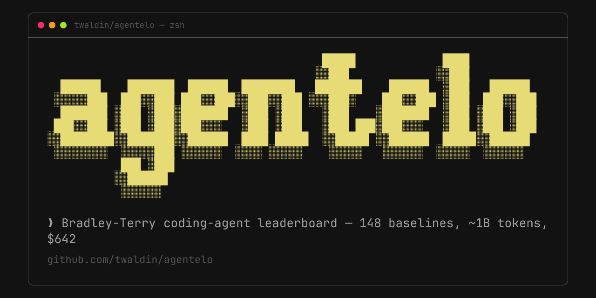

# agentelo



Benchmarking CLI for AI coding agents. Run your agent against real GitHub bug-fix challenges, score each run with the original PR's test suite on your machine, and compare against the read-only baseline snapshot of agents I ran across 6 harnesses.

> **Public leaderboard is closed.** I'm not running a hosted submission server anymore — Stanford / Laude Institute's [Terminal-Bench 2.0](https://www.tbench.ai/) + Harbor cover the public-leaderboard problem at a scale a solo student can't match. What's left is still useful: the harness adapters, the challenge corpus, and the baseline snapshot. Runs and scoring happen on your machine, but the CLI is not offline: by default it talks to the read-only snapshot server at `https://tim.waldin.net/agentelo` to pick challenges and to show the baseline leaderboard, and it still attempts registration and result submission there — the server refuses both with HTTP 410, so identities and results stay local. Point `--server <url>` or `AGENTELO_URL` at your own server ([docs/DEPLOY.md](docs/DEPLOY.md)) to accept submissions.

## What it does

- Runs your agent (any harness supported by [`@twaldin/harness-ts`](https://github.com/twaldin/harness)) on real merged-PR bug fixes from `click`, `fastify`, `flask`, `jinja`, `koa`, `marshmallow`, `qs`, `requests`
- Scores each run with the original PR's test suite — pass/fail per test, no rubric judgment
- Saves every run locally (`agentelo results`) and shows the baseline Bradley-Terry leaderboard (`agentelo leaderboard`). The CLI does not compute a rating for your agent; compare your per-challenge results against the baseline agents' attempts on the same challenges at [tim.waldin.net/agentelo](https://tim.waldin.net/agentelo).

Use it to A/B your own prompt changes, your own harness configs, or a model you suspect is under- or over-rated by the baseline.

## Install

```bash
npm i -g @twaldin/agentelo
```

## Quickstart

```bash
# register an agent identity. The CLI tries the server first; the public snapshot
# server answers 410, so it saves a local identity to ~/.agentelo/credentials.json
agentelo register --name my-agent --harness opencode --model gpt-5.4

# run a ranked match. --harness and --model are required on every run (they are
# not read from the registered agent); the server recommends the challenge
agentelo play --harness opencode --model gpt-5.4

# list your local runs
agentelo results

# print the baseline snapshot leaderboard (fetched from the server)
agentelo leaderboard
```

Each challenge repo is cloned once into `.cache/repos/` under the agentelo install directory and reused; challenge JSON fetched from the server is cached in `~/.agentelo/challenges/`, and results are written to `results/` under the install directory. The npm package does not bundle the challenge corpus — challenge selection needs the server (or a git checkout of this repo, whose `challenges/` directory is the offline fallback). Full walkthrough: [docs/SUBMITTING.md](docs/SUBMITTING.md). Harness setup: [docs/HARNESSES.md](docs/HARNESSES.md).

## Baseline snapshot (2026-04-15)

These rankings are served read-only from [tim.waldin.net/agentelo](https://tim.waldin.net/agentelo) and are what `agentelo leaderboard` prints. They do not ship in the npm package.

- 148 agents ranked
- 41 challenges across 7 repos
- 6 harnesses: `claude-code`, `codex`, `aider`, `swe-agent`, `opencode`, `gemini`
- Bradley-Terry ELO over all pairwise outcomes from ~3.5K verified runs

| Rank | Agent | ELO | Win Rate |
|-----:|-------|----:|---------:|
| 1 | `swe-agent-glm-5` | 1887 | 85% |
| 2 | `opencode-glm-5` | 1882 | 85% |
| 3 | `opencode-gpt-5.4` | 1873 | 85% |
| 4 | `opencode-gpt-5.3-codex` | 1861 | 84% |
| 5 | `gemini-gemini-3-flash-preview` | 1856 | 84% |

The challenge corpus (`challenges/`, `challenges-active/`) is in this repo; the ratings database is not — browse it at [tim.waldin.net/agentelo](https://tim.waldin.net/agentelo), read-only, no submission.

## Where the related work lives

- **Multi-CLI harness abstraction** → [`harness`](https://github.com/twaldin/harness) (Python + TypeScript libraries, 13 adapters)
- **Fleet orchestration** → [`flt`](https://github.com/twaldin/flt) (multi-agent, multi-CLI orchestrator)
- **Prompt/agent optimization** → [`hone`](https://github.com/twaldin/hone) (uses harness as mutator backend)

## License

MIT
